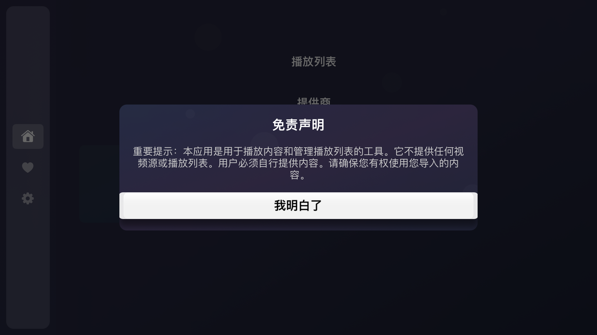

# 小葫芦IPTV

  

TVOS上使用的IPTV的播放工具 
TF地址 
- [https://testflight.apple.com/join/EVsAuvZn](https://testflight.apple.com/join/EVsAuvZn)

# 申明
工具只提供播放器，不提供内容

  

# 首页
左侧显示功能列表，右边展示首页，首页显示订阅列表并且可以添加订阅

  

选中首页后，侧边栏会收起

  

# 收藏
显示收藏的频道卡片

  

# 播放列表
显示播放列表，可以检测网络状态，列表上会显示频道的图标+文字，通过遥控器上下切换频道，当需要沉浸式的播放视频，可以通过select 按钮，进去播放页面，右侧可以收藏该频道，可以对频道列表进行测速，删除无法使用的频道

  

# 播放页面
在播放列表页面，点击向右的箭头，焦点移动到视频上，点击select按钮，全屏展示视频播放器

  

# 统计
进入设置页面

  

# EPG相关
EPG设置

  

浏览EPG

  

EPG详情

  

# 设置
进入设置页面

  

# 进入IPTV的设置

  

### releases

- [releases.md](https://github.com/never88gone/XHLIPTV/blob/main/releases.md?plain=1)

### Telegram Group
-  [https://t.me/tanghulutvos](https://t.me/tanghulutvos)

 

  

### Links

- [debugly/fsplayer](https://github.com/debugly/fsplayer)
- [ikishorek/TVVLCKit](https://github.com/ikishorek/TVVLCKit)
- [SnapKit/Masonry](https://github.com/SnapKit/Masonry)
- [jsonmodel/jsonmodel](https://github.com/jsonmodel/jsonmodel)
- [CocoaLumberjack/CocoaLumberjack](https://github.com/CocoaLumberjack/CocoaLumberjack)
- [SDWebImage/SDWebImage](https://github.com/SDWebImage/SDWebImage)
-  [lechium/KBBulletinView](https://github.com/lechium/KBBulletinView)
-  [vtourraine/VTAcknowledgementsViewController](https://github.com/vtourraine/VTAcknowledgementsViewController)
-  [AliSoftware/Reusable](https://github.com/AliSoftware/Reusable)
-  [nicklockwood/GZIP](https://github.com/nicklockwood/GZIP)
-  [robbiehanson/CocoaAsyncSocket](https://github.com/robbiehanson/CocoaAsyncSocket)
-  [SwiftyJSON/SwiftyJSON](https://github.com/SwiftyJSON/SwiftyJSON)
-  [yichengchen/swifter](https://github.com/yichengchen/swifter)
